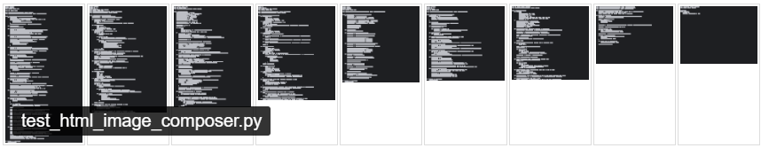
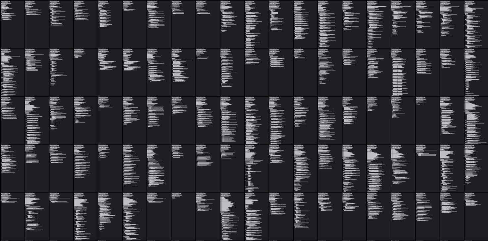

# Code Visualizer

## Overview

**Code Visualizer** is a tool that helps developers analyze the structure of their code by generating abstract visual representations. Instead of displaying source code as text, this tool converts it into simple line-based images, making it easier to identify structural issues at a glance.

## Features

- **Load Code from GitHub or Local Files**\
  Supports loading software projects directly from a GitHub repository or from a local directory.

- **Abstract Visual Representation**\
  Source code is visualized as simple lines instead of text. This allows developers to focus on structural patterns rather than specific syntax.

- **Grid or Single Image Layout**\
  The generated images can be arranged in a grid within an HTML file. Alternatively, all images can be combined into one large image for an overview of the entire project.

- **Identify Structural Issues**

  - Detect **"Pyramid of Doom"** patterns (deeply nested structures that reduce readability).
  - Identify **long files** that may need refactoring.
  - Gain insights into the general structure of a codebase at a glance.

## Why Use Code Visualizer?

- **Faster Code Reviews** – Spot problematic structures without reading every line of code.
- **Better Code Quality** – Find areas that might need refactoring.
- **Language-Agnostic** – Works with any programming language, as it focuses on structure rather than syntax.

## Example Output

- html example 
**

- spliced image example
**

## License

This project is licensed under the [Mozilla Public License 2.0](https://opensource.org/licenses/MPL-2.0). You are free to use, modify, and distribute this project as long as you provide attribution to the original authors.

### AI-Training Restriction

This project and its contents may not be used for training artificial intelligence models, machine learning algorithms, or any other data-driven models without explicit written permission from the original author.
